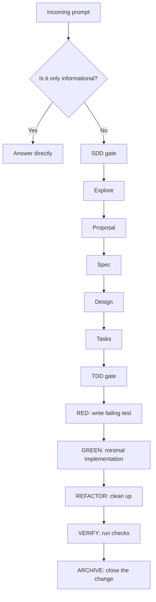

# Implementation Gate

This rule is mandatory for every prompt that enters implementation work in `el-fulbo`.

## Unbreakable rule

Every prompt must pass through the gate below.

- If the prompt is purely informational, answer it directly.
- If the prompt requests a change, review, fix, refactor, feature, or cleanup, it must go through SDD first.
- If the prompt leads to code changes, it must then be delivered through TDD.
- If there is any doubt, treat the prompt as implementation work and route it through the full gate.

## Required flow

## SDD rules

1. No implementation starts without a clear spec.
2. No design starts without a validated scope.
3. No task list starts without an agreed proposal.
4. No change is considered ready until it is traceable to a spec.

## TDD rules

1. The first executable artifact is a failing test.
2. Implementation must be the minimum needed to pass.
3. Refactoring happens only after the test is green.
4. Verification must confirm the behavior, not only the syntax.

## Agent responsibilities

- **Orchestrator**: routes the prompt and enforces the gate.
- **Explorer**: gathers context and risk.
- **Spec agent**: defines behavior and acceptance criteria.
- **Designer**: translates the spec into architecture and boundaries.
- **Task agent**: splits the work into testable units.
- **TDD implementer**: writes the failing test and the minimal fix.
- **Verifier**: proves the result.
- **Archivist**: closes the change and preserves the trace.

## Hard stop conditions

- A prompt that asks for code without a spec is not actionable.
- A prompt that skips the failing test is not allowed to proceed.
- A prompt that bypasses the gate must be redirected back to the workflow.
- If the scope is unclear, the correct action is to stop and clarify, not guess.

## Default behavior

When a prompt enters the project:

1. classify it;
2. decide whether it is informational or implementation work;
3. route implementation work through SDD;
4. route code changes through TDD;
5. only then proceed.

This is the normal path. It is not optional.
